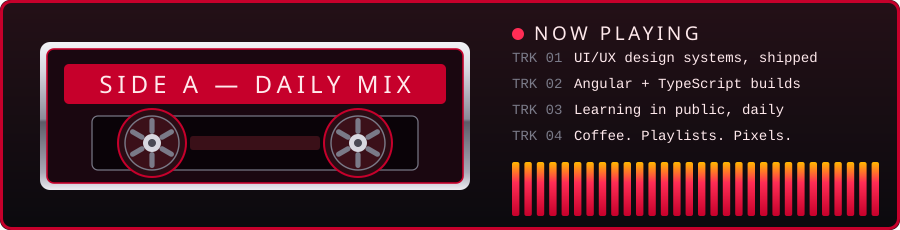

<!--
═══════════════════════════════════════════════════════════════════════
  PROFILE README — Camila Reimann
  Drop this file in a repo named exactly like your username.
  Replace every YOUR-USERNAME below (Ctrl+H, one pass, done).
  The /assets folder must sit next to this file.
═══════════════════════════════════════════════════════════════════════
-->

<div align="center">





<!-- ── hit counter, very 1998 ─────────────────────────────────────── -->


</div>


## 📻 ABOUT THE DJ

<table>
<tr>
<td width="55%" valign="top">

**Camila Reimann** — UI/UX designer turned front-end dev, currently building things at **iHeartMedia**.

I care about interfaces that get out of the way, design systems that survive contact with production, and the unglamorous work of making a thing actually usable. Started in design, kept going until I could ship the code too.

Off the clock: playlists, games, and a suspicious number of half-finished side projects.

</td>
<td width="45%" valign="top">

```
┌──────────────────────────────┐
│  STATION ID                  │
├──────────────────────────────┤
│  FORMAT ...... design + dev  │
│  BAND ........ front-end     │
│  SIGNAL ...... UI/UX         │
│  ROTATION .... daily         │
│  REQUESTS .... always open   │
└──────────────────────────────┘
```

</td>
</tr>
</table>


## 💿 NOW PLAYING




## 🎛️ THE SOUNDBOARD

<div align="center">

**ON THE BOARD**


**BACK OFFICE**


**PRODUCTION BOOTH**


</div>


## 📊 THE RATINGS BOOK

<div align="center">


</div>


## 🎧 TOP 8

<!-- The MySpace Top 8, except it's the stuff I actually reach for. -->

<div align="center">

| | | | |
|:-:|:-:|:-:|:-:|
| **1.** VS Code | **2.** Figma | **3.** Angular CLI | **4.** DevTools |
| **5.** Storybook | **6.** Postman | **7.** Notion | **8.** A very long playlist |

</div>


## 📼 REQUEST LINE

<div align="center">

<a href="https://www.linkedin.com/in/camilareimann/">
  
</a>
<a href="https://camilareimann.com.br/">
  
</a>
<a href="mailto:YOUR-EMAIL">
  
</a>

<br><br>

<details>
<summary><b>✍️ SIGN MY GUESTBOOK</b></summary>
<br>

Open an issue on this repo and say hi. Bonus points if you leave a song.

</details>

</div>


<div align="center">

```
        .-"""-.        ♥ ♥ ♥        .-"""-.
       /       \                   /       \
      |  ◉   ◉  |   THANKS FOR    |  ◉   ◉  |
      |    ▽    |    TUNING IN    |    ▽    |
       \  ---  /                   \  ---  /
        '-...-'                     '-...-'
   ═══════════════════════════════════════════
    ▐▐▐  KEEP IT LOCKED  ▐▐▐  BACK AFTER THIS  ▐▐▐
   ═══════════════════════════════════════════
```


<sub><i>Camila is in your extended network.</i></sub>

</div>
